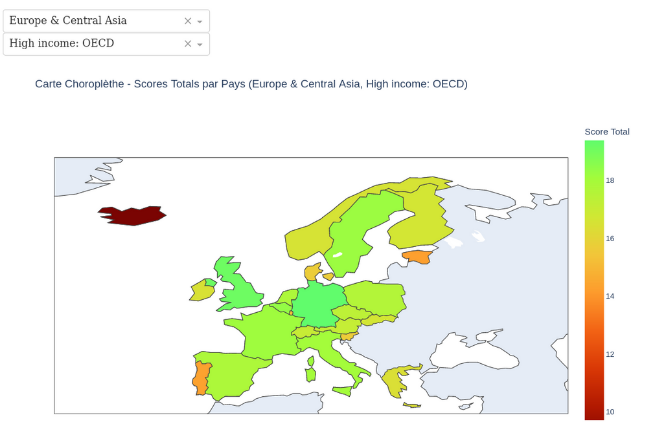

# Analyse des Données de Systèmes Éducatifs

  

## Contexte

Je suis Data Scientist pour **academy**, une start-up EdTech spécialisée dans la création de contenus de formation en ligne destinés aux étudiants de niveau lycée et université. Dans le cadre de notre stratégie d'expansion internationale, j'ai été chargé d'analyser des données éducatives mondiales fournies par la Banque mondiale. Cette analyse vise à identifier les marchés potentiels pour notre entreprise, en s'appuyant sur des indicateurs éducatifs clés.

## Objectif du Projet

L'objectif de ce projet est de réaliser une analyse pré-exploratoire des données issues de l'organisme "EdStats All Indicator Query" de la Banque mondiale. Cette analyse permettra d'évaluer la pertinence de ces données pour informer les décisions d'expansion de **academy** vers de nouveaux pays.

## Étapes de l'Analyse

1. **Validation de la qualité des données** :
    - Identification des données manquantes et dupliquées.
    - Évaluation de la fiabilité du jeu de données pour une analyse ultérieure.

2. **Description des données** :
    - Analyse des caractéristiques du jeu de données : nombre de lignes, colonnes, types de données, etc.
    - Calcul du taux de valeurs manquantes par colonne.

3. **Sélection des données pertinentes** :
    - Identification des colonnes et indicateurs les plus pertinents pour répondre à la problématique de l'entreprise.
    
4. **Analyse statistique des données** :
    - Calcul des moyennes, médianes, écarts-types, et autres statistiques descriptives par pays et par continent.
    - Identification des valeurs aberrantes selon des méthodes statistiques et métier.

5. **Visualisation des données** :
    - Création de graphiques clairs et lisibles pour illustrer les principales tendances éducatives.
    - Utilisation de Jupyter Notebook pour structurer et documenter l'analyse, avec des cellules Markdown pour clarifier chaque étape.

## Livrables

- **Jupyter Notebook** : Contenant l'analyse pré-exploratoire des données. Ce notebook est structuré et commenté pour faciliter la compréhension et la réutilisation du code.
- **Support de Présentation** : Diaporama synthétisant les résultats de l'analyse, prêt à être présenté devant un jury ou lors d'une réunion stratégique.

## Soutenance

### Déroulement de la Soutenance

- **Présentation (20 minutes)** :
    - Introduction : Présentation de la problématique et du jeu de données (5 minutes).
    - Analyse : Discussion détaillée de l'analyse pré-exploratoire et de la pertinence des données pour répondre aux questions stratégiques (15 minutes).
    
- **Discussion (5 minutes)** :
    - Échanges avec l'évaluateur sur les choix méthodologiques et les résultats.
    
- **Débriefing (5 minutes)** :
    - Retour sur la présentation et les points forts/axes d'amélioration.
    
### Visionner la Soutenance

Vous pouvez visionner l'enregistrement de la soutenance à l'adresse suivante : [Vidéo Youtube](https://youtu.be/EdjVrh1zahw?si=TAe9uBU1XMUpA1bM).

### Critères d'Évaluation Techniques

- Mise en place d'un environnement Python avec les librairies nécessaires.
- Utilisation efficace des boucles, conditions, et structures de données (dataframes).
- Manipulation des données (chargement, description, sélection, agrégation).
- Réalisation d'analyses statistiques et graphiques avec des outils appropriés.
- Documentation claire et structurée dans Jupyter Notebook.

## Contact

Pour en savoir plus sur moi et accéder à toutes mes informations de contact, vous pouvez visiter mon site web : [alexandre.rogues.fr](https://alexandre.rogues.fr).

Merci de l'intérêt que vous portez à ce projet !

